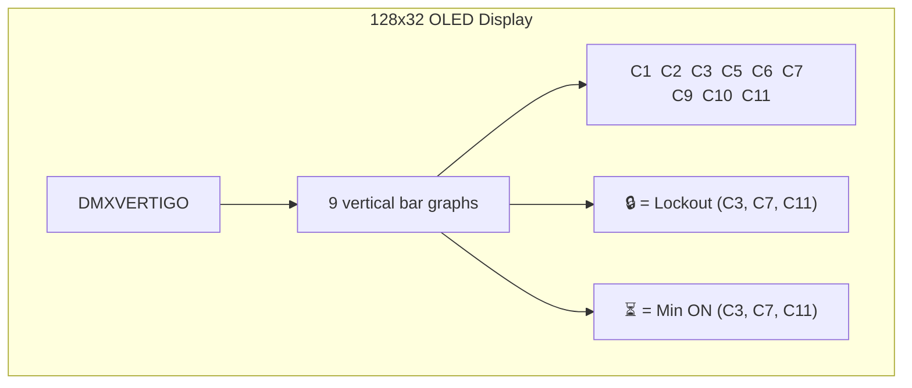
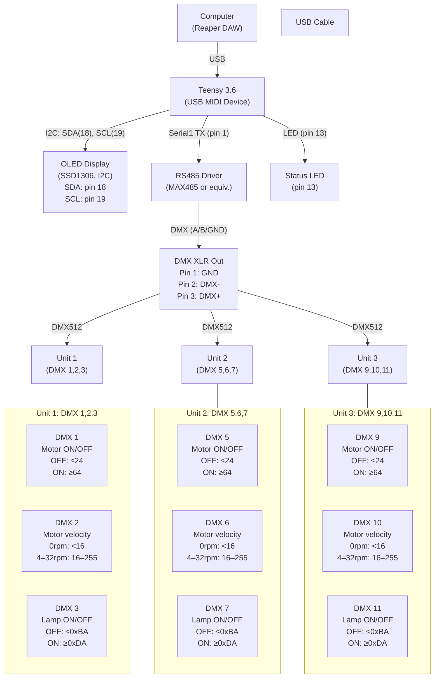

# VertigoCC2DMX

Robust Teensy 3.6 USB MIDI to DMX translator with OLED feedback and strict lamp safety logic.

---

## Quick Start

1. Gather all hardware (see Bill of Materials below).
2. Wire up according to the wiring table and diagrams.
3. Install Arduino IDE and required libraries (Adafruit SSD1306, Adafruit GFX, TeensyDMX).
4. Set Board: Tools > Board: Teensy 3.6. Set USB Type: Serial + MIDI.
5. Open firmware (`teensy36_usb_midi_dmx_arduinoIDE.ino`).
6. Connect Teensy via USB to your computer.
7. Upload the firmware.
8. Test with your DAW (Reaper) and verify OLED/DMX output.

---

## Bill of Materials (BOM)

| Item                        | Example/Part No.                | Qty | Notes                                  |
|-----------------------------|----------------------------------|-----|----------------------------------------|
| Teensy 3.6                  | PJRC Teensy 3.6                  | 1   | Main controller                        |
| OLED Display (128x32, I2C)  | Adafruit SSD1306                 | 1   | 0x3C address, 3.3V logic               |
| RS485/DMX Driver            | MAX485 or equiv.                 | 1   | For DMX output                         |
| XLR Connector (DMX out)     | 3-pin XLR (male)                 | 1   | DMX512 standard                        |
| Status LED                  | Built-in (Teensy pin 13)         | 1   | Used for error/status                  |
| Wires, breadboard, etc.     | -                                | -   | For prototyping                        |
| Computer with Reaper DAW    | -                                | 1   | For MIDI CC control                    |
| Power supply (if needed)    | 5V USB or external               | 1   | Teensy powered via USB                 |

---

## Wiring Table

| Function         | Teensy Pin | Peripheral         | Notes                |
|------------------|------------|-------------------|----------------------|
| OLED SDA         | 18         | OLED (SSD1306)    | I2C data             |
| OLED SCL         | 19         | OLED (SSD1306)    | I2C clock            |
| DMX TX           | 1          | RS485 Driver DI   | Serial1 TX           |
| DMX RX           | 0          | (optional)        | Serial1 RX (unused)  |
| Status LED       | 13         | Built-in LED      | Error/status         |
| GND, 3.3V, VIN   | -          | All peripherals   | Power, common ground |

---

## ⬆️ Firmware Upload Instructions

1. 💻 **Install Arduino IDE and Teensyduino add-on.**
2. 📦 **Install required libraries:** Adafruit SSD1306, Adafruit GFX, TeensyDMX.
3. 📂 **Open** `teensy36_usb_midi_dmx_arduinoIDE.ino` in Arduino IDE.
4. 🧩 **Set Tools > Board:** **Teensy 3.6** and **USB Type:** **Serial + MIDI** (not just "MIDI").
5. 🔌 **Select correct COM port.**
6. ⬆️ **Click Upload.**
7. 🟢 **Confirm OLED displays "DMXVERTIGO" and bar graphs.**
8. 🎹 **Test MIDI CC input from Reaper or other DAW.**

> ⚠️ **Reliability Tip:**
> For this project and board (Teensy 3.6), **PlatformIO does not work reliably** for SERIAL+USB MIDI mode. Use the Arduino IDE with Teensyduino, and set **USB Type: Serial + MIDI** for best results.

---

## Troubleshooting

| Problem                        | Possible Cause                | Solution                                  |
|--------------------------------|-------------------------------|-------------------------------------------|
| OLED screen blank              | Wiring, address, library      | Check I2C wiring, use 0x3C, reinstall lib |
| No DMX output                  | RS485 wiring, code, library   | Check TX pin, driver, TeensyDMX installed |
| No MIDI response               | USB type, DAW config          | Set USB type to MIDI, check DAW output    |
| Lamps won’t turn ON/OFF        | Lockout/min ON logic active   | Wait for timer, check firmware state      |
| Teensy not detected            | USB cable, drivers            | Try another cable/port, reinstall drivers |

---

## Glossary

- **DMX**: Digital Multiplex, lighting control protocol (DMX512)
- **MIDI CC**: MIDI Control Change message, used for parameter control
- **Lockout**: Prevents lamp from turning ON for 15 min after OFF
- **Minimum ON time**: Lamp must stay ON for 10 min before OFF
- **RS485**: Differential serial bus used for DMX
- **DAW**: Digital Audio Workstation (e.g. Reaper)

---

## License and Contribution

This project is open source (MIT License). Contributions welcome!

**To contribute:**
- Fork the repo, create a feature branch, submit a pull request.
- Please document any hardware or code changes clearly.

---

## Visuals

<!-- Add a photo of the assembled hardware and a screenshot of the OLED UI here. -->

---

## Changelog

<!-- Removed repeated project description -->

---

## Visual Overview

### OLED Screen UI

---

## MIDI CC to DMX Channel Mapping and Functions

This project maps MIDI CC messages from a DAW (e.g. Reaper) to DMX channels for controlling three motor/lamp units. Each unit uses three DMX channels:

| Unit   | DMX Channels | MIDI CCs      | Function (per unit)         | Parameter/Thresholds                |
|--------|--------------|---------------|-----------------------------|-------------------------------------|
| Unit 1 | 1, 2, 3      | CC1, CC2, CC3 | 1: ON/OFF, 2: velocity, 3: lamp ON/OFF | ON/OFF: ≥64/≤24, Vel: 16–255, Lamp: ≥0xDA/≤0xBA |
| Unit 2 | 5, 6, 7      | CC5, CC6, CC7 | 5: ON/OFF, 6: velocity, 7: lamp ON/OFF | ON/OFF: ≥64/≤24, Vel: 16–255, Lamp: ≥0xDA/≤0xBA |
| Unit 3 | 9, 10, 11    | CC9, CC10, CC11| 9: ON/OFF, 10: velocity, 11: lamp ON/OFF| ON/OFF: ≥64/≤24, Vel: 16–255, Lamp: ≥0xDA/≤0xBA |

**Parameter details:**
- **ON/OFF (motor):** DMX <24 = OFF, >64 = ON
- **Velocity (motor):** DMX 16–255 = 4–32rpm, <16 = 0rpm
- **Lamp ON/OFF:** DMX <0xBA = OFF, >0xDA = ON

**Lamp safety:**
- After turning a lamp OFF (DMX 3, 7, 11), a 15-minute lockout is enforced before it can be turned ON again.
- Minimum ON time: Once ON, lamp must stay ON for at least 10 minutes before it can be turned OFF.
- These rules are enforced in firmware for all lamp channels.

**Unused DMX channels:** 4, 8, 12, 13 (not mapped)

---

### Hardware Block Diagram & Connections

---

## Features

- **USB MIDI to DMX translation** (Teensy 3.6, Arduino IDE)
- **9 fader columns** (C1, C2, C3, C5, C6, C7, C9, C10, C11) mapped to DMX channels 1,2,3,5,6,7,9,10,11
- **OLED bar graph UI**: Real-time feedback, lock/timer icons, clear labels
- **Lamp safety logic**:
  - 15 min lockout after OFF (cannot turn ON again)
  - 10 min minimum ON time (cannot turn OFF early)
  - Visual lock/timer feedback per lamp
- **Soft start**: All non-lamp DMX channels ramp up on boot; lamp channels always start OFF
- **MIDI flood protection**: Only the latest value per CC is processed each loop
- **Error feedback**: OLED and LED error display for critical failures
- **Well-documented, maintainable code**

---

## Hardware Requirements

- **Teensy 3.6** (set USB type to "MIDI")
- **Adafruit SSD1306 OLED** (128x32, I2C)
- **RS485/DMX output** (TeensyDMX library, Serial1)
- **MIDI controller** (sends CC messages)

---

## Wiring Overview

- **OLED**: Connect to I2C (SDA/SCL, 0x3C)
- **DMX**: Connect Serial1 TX to RS485 driver
- **LED**: Built-in LED used for status/error

---

## MIDI/DMX Mapping

| Column | MIDI CC | DMX Channel |
|--------|---------|-------------|
| C1     |   1     |     1       |
| C2     |   2     |     2       |
| C3*    |   3     |     3       |
| C5     |   5     |     5       |
| C6     |   6     |     6       |
| C7*    |   7     |     7       |
| C9     |   9     |     9       |
| C10    |  10     |    10       |
| C11*   |  11     |    11       |

*Lamp channels (strict lockout/minimum ON logic)

---

## OLED UI

- **Top**: "DMXVERTIGO" title, stretched and centered
- **Middle**: 9 vertical bar graphs (one per CC/DMX channel)
  - **Lock icon**: Lamp in lockout (15 min after OFF)
  - **Timer bar**: Lamp in minimum ON period (10 min after ON)
- **Bottom**: CC labels (C1, C2, C3, C5, C6, C7, C9, 10, 11)

---

## Lamp Safety Logic

- **Lockout**: After a lamp (C3, C7, C11) is turned OFF, it cannot be turned ON again for 15 minutes
- **Minimum ON**: Once ON, a lamp cannot be turned OFF until it has been ON for at least 10 minutes
- **Visual feedback**: Lock/timer icons on OLED
- **State is NOT persistent** (lost on power cycle)

---

## Startup Behavior

- **Lamp channels (3,7,11)**: Always start OFF, never ramped
- **Other DMX channels**: Soft start ramp from 0 to initial value

---

## Error Handling

- **OLED init failure**: Blinks LED, shows error on OLED, halts
- **Critical errors**: showCriticalError() displays message and blinks LED

---

## How to Build & Upload

1. Open in **Arduino IDE**
2. Set board to **Teensy 3.6**
3. Set USB type to **MIDI**
4. Install libraries:
   - Adafruit SSD1306
   - Adafruit GFX
   - TeensyDMX
5. Connect Teensy, select port
6. Upload the sketch

---

## Customization

- **Change mapping**: Edit `ccList`, `ccNames`, `dmxMap` arrays
- **Adjust safety times**: Edit `LAMP_LOCKOUT_MS`, `LAMP_MIN_ON_MS`
- **UI tweaks**: Edit `drawFaders()`

---

## File Structure

- `teensy36_usb_midi_dmx_arduinoIDE.ino` — Main firmware
- `README.md` — This file

---

## License

MIT License (see LICENSE file)

---

## Credits

- Code: RVX aka Victor Mazon Gardoqui
- Libraries: Adafruit, qindesign (TeensyDMX)
- Hardware: Teensy 3.6, Adafruit SSD1306 OLED

---

## Screenshots

*(Add photos of the OLED UI and hardware setup here!)*

---

## Troubleshooting

- **OLED not displaying**: Check wiring, address (0x3C), library install
- **DMX not working**: Check RS485 wiring, Serial1 TX, DMX cable
- **Lamp lockout/minimum ON not working**: Ensure correct CC/DMX mapping, check code comments
- **Upload fails**: Check Teensy board/port, USB type

---

For questions or improvements, open an issue or pull request on GitHub!
